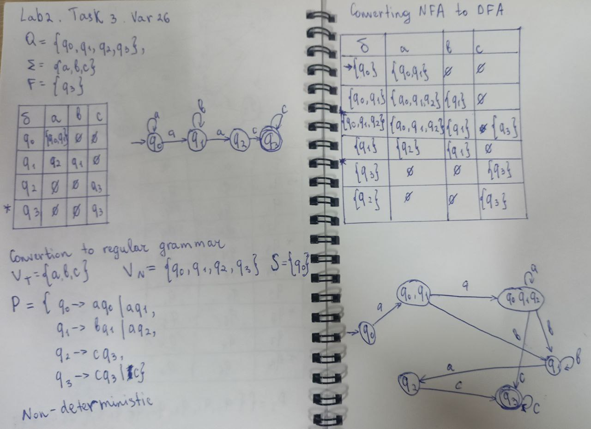

# Determinism in Finite Automata. Conversion from NDFA 2 DFA. Chomsky Hierarchy.

### Course: Formal Languages & Finite Automata
### Author: Tatrintev Denis (FAF-232)

----

## Theory
### Chomsky Classification
**Type 0. Recursively Enumerable Grammar** no restrictions on productions  for example: $alpha->beta$

**Type 1. Context-Sensitive Grammars** all production are in the form $a_1Aa_2->a_1Beta_2$ where $a_1,a_2$ is $(V_nUV_t)^*, Bet$ is $(V_NUV_T)^+, A$ is $V_N$ 
- left-context-sensitive grammar $a_1A->a_1Bet$
- right-context-sensitive grammar $Aa_2->Beta_2$

**Type 2. Context-Free Grammar** the all productions of grammar G must be in form $A->Bet,$ where $A$ is $V_N,Bet$ is $(V_nUV_t)^*$

**Type 3. Regular Grammar** is most restricted grammar and it has two representations as
1. Right Linear Grammar: $A->aB, A->a$ where $a$ is $V_T, A,B$ is $V_N$
2. Left Linear Grammar: $A->bA, A->a$ where $a$ is $V_T, A,B$ is $V_N$

### Finite Automata
#### **Deterministic Finite Automaton**
A deterministic finite automaton is a 5-tuple ($Q, Σ, σ, q_0, F$)
- $Q$ is a finite set of states
- Σ is an input alphabet
- δ: $Q$ X $Σ -> Q$ is a transition function
- $q_0$ is from $Q$ and is the initial state
- $F$ is a subset from $Q$ and is a set of accepting states (of final states)
#### **E-Nondeterministic Finite Automaton (ε–NFA)**
A nondeterministic finite automaton is a 5-tuple ($Q, Σ, σ, q_0, F$)
- $Q$ is a finite set of states
- Σ is an input alphabet
- δ: $Q$ X ($Σ$ U {$ε$})$->$ subsets of $Q$ is a transition function; 
	can go into several states;
	it is allowed the ε-transitions
- $q_0$ is from $Q$ and is the initial state
- $F$ is a subset from $Q$ and is a set of accepting states (of final states)

## Objectives:
1. Understand what an automaton is and what it can be used for.
2. Continuing the work in the same repository and the same project, the following need to be added: 
a. Provide a function in your grammar type/class that could classify the grammar based on Chomsky hierarchy.
b. For this you can use the variant from the previous lab.
3. According to your variant number (by universal convention it is register ID), get the finite automaton definition and do the following tasks:

a. Implement conversion of a finite automaton to a regular grammar.

b. Determine whether your FA is deterministic or non-deterministic.

c. Implement some functionality that would convert an NDFA to a DFA.

d. Represent the finite automaton graphically (Optional, and can be considered as a bonus point):
- You can use external libraries, tools or APIs to generate the figures/diagrams.
- Your program needs to gather and send the data about the automaton and the lib/tool/API return the visual representation.

Please consider that all elements of the task 3 can be done manually, writing a detailed report about how you've done the conversion and what changes have you introduced. In case if you'll be able to write a complete program that will take some finite automata and then convert it to the regular grammar - this will be a good bonus point.

## My variant
``` 
Variant 26
Q = {q0,q1,q2,q3},
∑ = {a,b,c},
F = {q3},
δ(q0,a) = q1,
δ(q1,b) = q1,
δ(q1,a) = q2,
δ(q0,a) = q0,
δ(q2,c) = q3,
δ(q3,c) = q3 
```

## Implementation description
* Here is presented the Code part from `Grammar.cs` Where is checked what Chomsky Type is the grammar from previous lab. The `IsType` functions will be described down below. It just checks and returns the number of the type of grammar that was already verified

```cs
public int GetChomskyType()
{
    if (IsType3()) return 3;
    if (IsType2()) return 2;
    if (IsType1()) return 1;
    return 0;
}
```

* I created the 3 `IsType` functions to verify Chomsky Type 3, chomsky Type 2 and Chomsky Type 1. The Type 0 is obviously the any left grammar that won't fit perfectly in those 3 previous types. Here is presented the Type 2 verification. 

```cs
private bool IsType2()
    {
        // Context-Free Grammar: All productions are of the form A → α where α is any string of terminals and non-terminals
        foreach (var rule in P)
        {
            char nonTerminal = rule.Key;
            if (!V_N.Contains(nonTerminal)) return false;
        }
        return true;
    }
```

* For the Type 2 I used the simple description from the provoded book. It says that: Context-Free Grammar is the grammar where all productions are of the form A → α where α is any string of terminals and non-terminals. that means that we do not pay attention to the right side and just make sure that left side do not contain non-terminals like `a`, `b` or `c` for example.

* The final step was a `Program2.cs` class to output the results of the 2nd laboratory work. Here I just created a new `Grammar` type object and used `GetChomskyType()` and `GetChomskyTypeDescription()` methods to get the reult and then just printed the result.

```cs
switch (chomskyType)
{
    case 3:
        Console.WriteLine("This is a Regular Grammar");
        break;
    case 2:
        Console.WriteLine("This is a Context-Free Grammar");
        break;
    case 1:
        Console.WriteLine("This is a Context-Sensitive Grammar");
        break;
    case 0:
        Console.WriteLine("This is an Unrestricted Grammar");
        break;
}

```
* **Finite Automata** (**FA**) are like simple machines that follow a set of rules to process a sequence of inputs (like letters or numbers) and decide if they are valid or not. 



Here is presented the Whole Task 3 implementation. 
First Step was converting the FA to Regular Grammar. 

**Algorithm Description**
1. $V_N=Q$
2. $V_T=Σ$
3. $S=q_0$
4. For production P:
- a)P = ∅; 
- b) For all values $δ(q, a) = (q1, q2,…, q_m)$ we have: P = P ∪ {$q → aq_i | i=1,m$} 
- c) For all values $δ(q, a) = (q1, q2,…, q_m)$, if F ∩ {$q1, q2,…, q_m$} is not ∅ we have P = P ∪ {$q → a$}

Next step was saying if FA is either eterministic or non-deterministic. Since it has the situation when after state $q_0$ after getting $a$ can get both to states $q_0$ and $q_1$ it is NFA (Non-Deterministic).

Now I have to convert the NFA to DFA and to draw a graphical representation

**1st Algorithm of conversion NFA to DFA (analytical conversion)**

1. Initialize the initial state $q_0$ and this state add to the Q’: $Q'=∅;[q_0]'=q_0;Q'=${$[q_0]$}
2. Determinate the transition function by the following rule: $δ(${$q_0,q_1,q_2,...,q_n$}$,a)=∪$ from i=1 to n δ($q_1$,a)
3. For all states from $q_0,q_1,q_2,...,q_n$ is from Q', present $δ(${$q_0,q_1,q_2,...,q_n$}$,a)=${$p_0,p_1,p_2,...,p_n$} are from Σ. If {$p_0,p_1,p_2,...,p_n$} is not from Q', then it is included to the Q' and it is defined the transition function δ
4. Repeat the $3^r$$^d$ step until occur the changes in Q'
5. Define the set of final states as F'=({$q_0,q_1,q_2,...,q_n|q_i, 1<=i<=n,q_i$ is from F})

**2nd Algorithm of conversion NFA to DFA (table conversion)**
1. Create the state table for the given NFA
2. Create a blank state table under possible input alphabets for the equivalent DFA
3. Mark the start state of the DFA by $q_0$ (same as the NFA)
4. Find out the combination of states {$q_0,q_1,...,q_n$} for each possible input alphabet
5. Each time it is generated the new DFA state under the input alphabet columns, it should be applied the step 4 again, otherwise go to step 6.
6. The states which contain any of the final states of the NFA are the final states of the equivalent DFA.

## Results
- Output 1:
```powershell
Chomsky Type -> Type 3: Regular Grammar
This is a Regular Grammar
```

## Conclusions 
Here's a conclusion for your lab work covering the two tasks:

## Conclusion
This laboratory work focused on implementing and analyzing core concepts from formal language theory, specifically grammars and finite automata.
In the 2nd task, I successfully implemented functionality to determine the Chomsky Type of a grammar. By examining the structure of production rules, my program can accurately classify grammars into Type 0 (Unrestricted), Type 1 (Context-Sensitive), Type 2 (Context-Free), or Type 3 (Regular).

The 3d task outlined for future implementation involves deeper exploration of finite automata, including:
- Converting finite automata back to regular grammars
- Determining whether an automaton is deterministic or non-deterministic
- Implementing conversion from NDFA to DFA
- Optional graphical representation of automata

These implementations will complete the bidirectional conversion between grammars and automata, demonstrate the equivalence of NFAs and DFAs, and provide visual representations to enhance understanding. Through this lab work, I've gained practical experience with formal language concepts, understanding the theoretical hierarchy of grammars and their relationship to different types of automata. These implementations provide a foundation for analyzing and manipulating formal languages computationally.
## References
1. Cretu's GitHub Repository: https://github.com/filpatterson/DSL_laboratory_works/tree/master/1_RegularGrammars
2. LFA ELSE Course: https://else.fcim.utm.md/course/view.php?id=98
