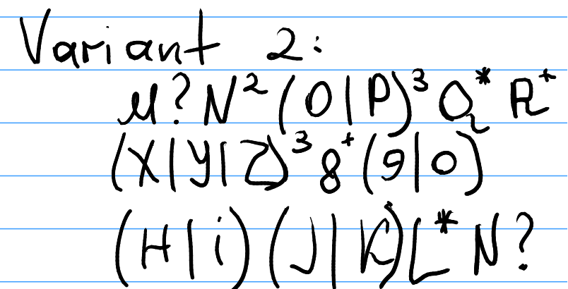

# Topic: Regular expressions

### Course: Formal Languages & Finite Automata
### Author: Tatrintev Denis (FAF-232)

----

## Theory
**Regular Expression**: It can be thought of as a algebraic description of DFA and NDFA. It is a sequence of characters that forms a search pattern, mainly for use in pattern matching with strings, or string matching.

A **Regular Expression** over S is an expression formed using the following rules:
- The symbols `Empty Set` and `E` are regular expressions
- Every `a` in `S` is a regular expression
- If `R` and `S` are regular expressions, so are `R+S`, `RS`
and `R*`.

A language is **Regular** if it is represented by a regular expression

Here’s a revised **THEORY** section for your laboratory report, structured without subsections (e.g., "1.1" or "2.3") while maintaining a formal academic style:

### **1. Equivalence Between Regular Expressions and Finite Automata**  
Regular expressions (RegEx) and finite automata (DFA/NFA) are formally equivalent models for describing **regular languages**. This equivalence is established by **Kleene’s Theorem**, which states that a language L over an alphabet Sigma is **regular** if and only if it can be recognized by a finite automaton (DFA or NFA) *and* expressed by a regular expression.  

To convert between these representations:  
- **From Regex to NFA**: **Thompson’s Construction** recursively builds an NFA by combining smaller NFAs for each subexpression. Base cases include empty language, empty string, and symbols (a in Sigma ). Operations like union (R + S), concatenation (RS), and Kleene star (R*) are implemented by introducing (varepsilon)-transitions between NFAs.  
- **From NFA to DFA**: The **subset construction** algorithm transforms an NFA into a DFA by treating sets of NFA states as single DFA states. 
- **From DFA to Regex**: The **state elimination method** iteratively removes DFA states, replacing transitions with regex labels until only a start-to-final path remains.  

### **2. Algebraic Laws of Regular Expressions**  
Regular expressions obey algebraic identities analogous to arithmetic. Below, (R), (S), and (T) denote arbitrary regular expressions:  

**Fundamental Identities**  
- **Union (( + ))**:  
  - Identity: (R + emptyset = R).  
  - Annihilator: (R +Sigma^* = Sigma^* ).  
  - Idempotence: (R + R = R).  
- **Concatenation (( * ))**:  
  - Identity: (R * E = E * R = R).  
  - Annihilator: (R * emptyset = emptyset * R = emptyset).   

**Kleene Star Properties**  
- (emptyset* = E) (the empty language’s closure matches the empty string).  
- (R* = E + RR*) (recursive definition).  
- (R** = R*) (idempotence of star operation).  

**Commutativity**  
- Union is commutative: (R + S = S + R).  
- Concatenation is *not* commutative: (RS != SR) unless (R = S).  


## Objectives:
1. Write and cover what regular expressions are, what they are used for;

2. Below you will find 3 complex regular expressions per each variant. Take a variant depending on your number in the list of students and do the following:

- a. Write a code that will generate valid combinations of symbols conform given regular expressions (examples will be shown). Be careful that idea is to interpret the given regular expressions dinamycally, not to hardcode the way it will generate valid strings. You give a set of regexes as input and get valid word as an output

- b. In case you have an example, where symbol may be written undefined number of times, take a limit of 5 times (to evade generation of extremely long combinations);

- c. Bonus point: write a function that will show sequence of processing regular expression (like, what you do first, second and so on)

Write a good report covering all performed actions and faced difficulties.

## My Variant


## Implementation description
* My code has only one file named `Program4.cs`. Here I have only 2 methods. Here is presented `Main` method. I write the regullar expressions from my variant as strings `RE1`, `RE2` and `RE3`. then I generate 5 strings for each of this regular Expression

```cs
public static void Main()
{
    string RE1 = "M?N^2(O|P)^3Q*R+";
    string RE2 = "(X|Y|Z)^38+(9|0)";
    string RE3 = "(H|i)(J|K)L*N?";
    for (int l1 = 0; l1 < 5; l1++) { StringGeneration(RE1); }
    Console.WriteLine();
    for (int l2 = 0; l2 < 5; l2++) { StringGeneration(RE2); }
    Console.WriteLine();
    for (int l3 = 0; l3 < 5; l3++) { StringGeneration(RE3); }
    Console.WriteLine();
}
```

* The Second Method `StringGeneration()` is created specifically for my variant and my regular expressions, so it may not works perfectly for other variants. 
1. First Part that is represented here is `?` after a symbol, except `)` symbol. The function randomly gets the value 0 or 1 and if the 1 was randomly set we output the symbol in front of `?`. Else do nothing if we get 0. 
2. The second part is the part of code with `*` symbol. This symbol gets the previous part of code and gets it randomly to the infinity, but based on requirements I let this be maximum number of 5. 
3. The third part with `+` sign works similar to previous, but it does not allow get a 0 value. So the symbol will be presented at least 1 time and at most 5 times. 

Here is presented the code part 1

```cs
// ? 
if ((REArr[i] == '?') && (char.IsLetter(REArr[i-1]) || char.IsDigit(REArr[i-1])) && (REArr[i-1]!=')'))
{
    Random rand = new Random();
    int randomNum = rand.Next(2);
    if (randomNum == 1) Console.Write(REArr[i-1]);
}
```

4. The forth part is the part of code with `^` that represents the power of next element. So if previous elemetn is not `)` then the next element is obviosly number and we repeat the element before `^` sign exactly that number of times as number is. 

``` cs
// ^
if ((REArr[i] == '^') && (char.IsLetter(REArr[i-1]) || char.IsDigit(REArr[i-1])) && (REArr[i-1]!=')'))
{
    int k = int.Parse(REArr[i+1].ToString());
    Console.Write(new string(REArr[i-1], k)); 
}
```

5. The last part is the biggest one. It include all aspects of situations where there is a choice of symbols inside `()`. In my code are presented only these examples that are included in my variant. 
- The first situation is the choice between 2 elements and no power of. Here I check id the element is `(` and the element +4 is `)`, that means that inside are 2 symbols and or sign `|`. Randomly getting the number 0 or 1 I get the left or right part of choices.
- Second situation is similar to previous but it also includes fact that after `)` is a symbol of power `^`. That means that after a random choice of sides inside braces this symbol will be repeated exactly power number times (the number after `^`).
- Third situation is simmilar to first, but now it checks if element is `(` and now element +6 is `)`. that means that inside braces are 3 elements and 2 or signs `|`. So the choice now extends from 2 to 3 elements.
- Last situation is the combination of second and third situation when there are 3 elemnts inside braces and the power sign `^` after braces to repeat the choice exact number of times.

## Results
```powershell
MNNOOOQQRR     
NNOOOQQRR      
NNPPPQQQQQRRRRR
MNNPPPQQQQQRR  
NNOOOQQQQQRRRRR

ZZZ88889       
YYY888889      
YYY8880        
ZZZ889
XXX88889       

HKLLLL
iJLN
iJLLLL
iKLLN
HKLN
```


## Conclusion

This laboratory work explored the theoretical foundations of **regular expressions (RegEx)** and their practical implementation through string generation. We confirmed the equivalence between RegEx and finite automata (DFA/NFA) via **Kleene's Theorem** and demonstrated their algebraic properties.

**Key Results:**
1. Developed a C# program to dynamically generate strings from given RegEx patterns (`M?N^2(O|P)^3Q*R+`, `(X|Y|Z)^38+(9|0)`, `(H|i)(J|K)L*N?`)
2. Successfully implemented all RegEx operators (`?`, `*`, `+`, `^`, `|`) with repetition limits (max 5)
3. Generated valid outputs like `MNNOOOQQRR`, `ZZZ88889`, and `iJLN`

**Challenges Solved:**
- Dynamic parsing of complex RegEx patterns
- Handling operator precedence and nested structures
- Limiting repetitions while maintaining correctness

The work successfully bridged theoretical concepts with practical implementation, demonstrating RegEx's power in pattern matching and language processing. Future improvements could include generalizing the solution for arbitrary patterns and adding processing visualization.
## References
1. Cretu's GitHub Repository: https://github.com/filpatterson/DSL_laboratory_works/tree/master/1_RegularGrammars
2. LFA ELSE Course: https://else.fcim.utm.md/course/view.php?id=98
